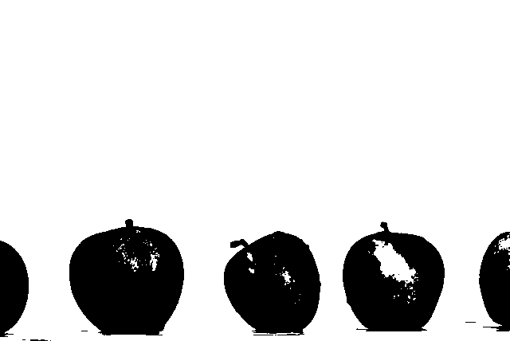
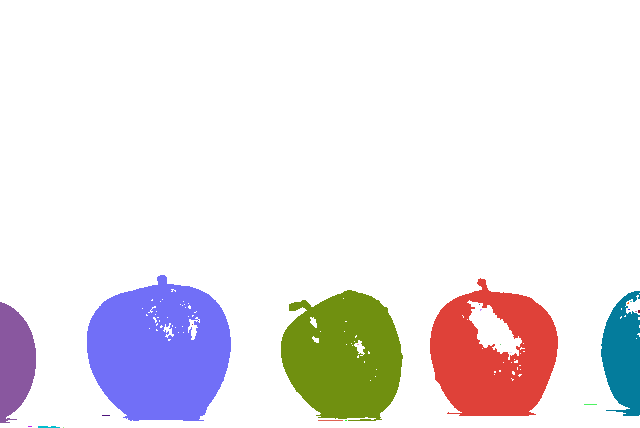

# Connected Component Labeling

A C implementation of Connected Component Labeling (CCL) algorithm for image processing. This program identifies and colors separate connected regions in binary images.

## Compilation & Usage

```bash
gcc ccl.c -o ccl
./ccl <path-to-image> <threshold>
```

- `path-to-image`: Path to the input image file
- `threshold`: Grayscale threshold value (0-255) for binary conversion

## Example: Apples Image
```bash
./ccl apples.jpg 160
```

#### Input Image


#### Step 1: Grayscale Conversion


#### Step 2: Binary Thresholding (threshold = 160)


#### Step 3: Connected Component Labeling


## References
[Connected-component labeling - Wikipedia](https://en.wikipedia.org/wiki/Connected-component_labeling)

[Disjoint-set data structure - Wikipedia](https://en.wikipedia.org/wiki/Disjoint-set_data_structure)

[Apples Photo by Isabella Fischer on Unsplash](https://unsplash.com/fr/photos/cinq-pommes-rouges-sur-une-surface-blanche-uSPjZzYwXO4?utm_source=unsplash&utm_medium=referral&utm_content=creditShareLink)